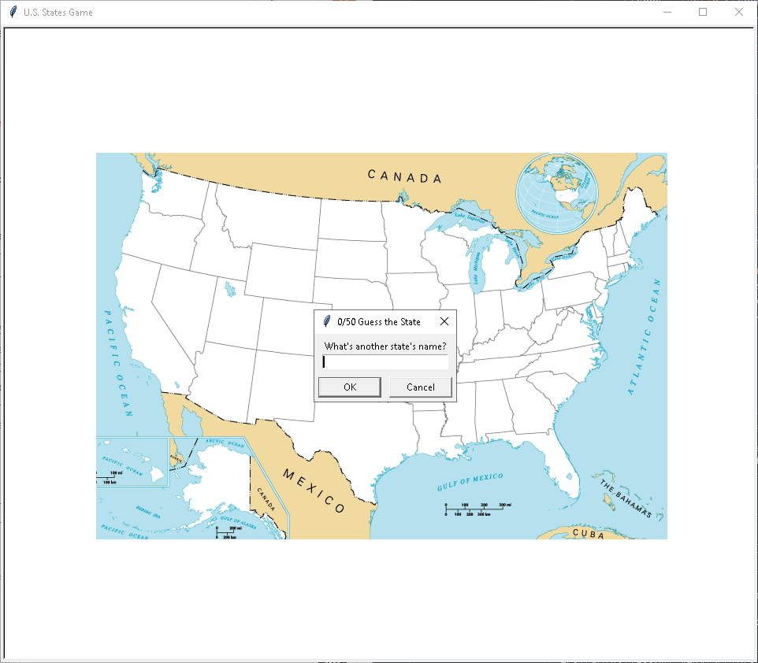

# 🗺️ U.S. States Game 🇺🇸

## Description
This is a fun and educational Python game that helps you learn the names of U.S. states by guessing them based on their locations on a map. The goal is to correctly guess all 50 states. If you need to exit, the game will save your progress and list the states you haven't guessed yet.

## Features
- Guess the U.S. states based on their location on a map.
- Displays the state names on the map once guessed correctly.
- Saves the states you didn't guess into a CSV file for later review.

## How to Use
1. Download the repository and make sure you have the required files (`50_states.csv` and `blank_states_img.gif`) in the same directory as the script.
2. Run the `main.py` script.
3. The game will display the map of the U.S. with blank states.
4. You will be prompted to enter a state name. Type the name of a state, and if correct, it will appear on the map.
5. To exit the game and save your progress, type "Exit".
6. The states you missed will be saved in a CSV file named `States_to_learn.csv`.

### Requirements
- Python 3.x
- `turtle` module (usually comes pre-installed with Python)
- `pandas` module (you can install it using `pip install pandas`)

## Demo GIF

## Technologies Used
- Python
- `turtle` (for graphics)
- `pandas` (for data manipulation)

---

👨‍💻 Created by [Tsaousidis](https://github.com/Tsaousidis)  
🎉 Have fun playing! Let me know your thoughts and suggestions! 🎉
